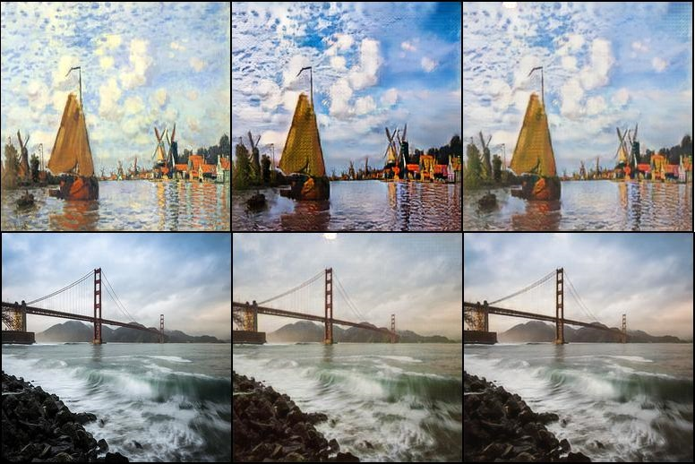

# CycleGAN
University of Illinois IE498 Final Project

[CycleGAN](https://junyanz.github.io/CycleGAN/) implementation using PyTorch

Image-to-Image Style Transfer without image pairs

## Usage


### Datasets
You can download a dataset with `download_dataset.sh` (from the [official CycleGAN repository](https://github.com/junyanz/pytorch-CycleGAN-and-pix2pix))
```
bash ./download_dataset.sh [name of dataset]
```

### Training
```
python ./main.py --train --dataset [name of dataset]
```

### Testing
You can generate a few test examples using the below command.
```
python ./main.py --test --dataset [name of dataset] --test_samples [number of test samples]
```

## Results

We achieved good results on the summer2winter, apple2orange, and monet2photo datasets.


The third image in each row represents attempted reconstruction of the second image back to the first image's domain.
### summer2winter


### apple2orange


### monet2photo
